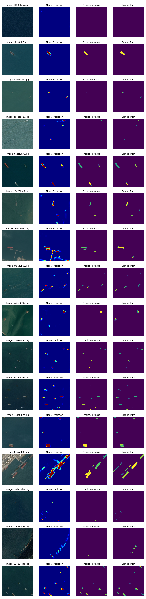

# Kaggle: [Airbus Ship Detection Challenge](https://www.kaggle.com/c/airbus-ship-detection)

## Overview

### System
OS: Windows 11 21H2

CPU: Intel Core i5-8400

GPU: Nvidia GTX 1080 Ti 11GB

RAM: 16 GB (+32GB virtual RAM)

### Data

The data is available on the [Kaggle website](https://www.kaggle.com/competitions/airbus-ship-detection/data).

You can download it in folder

+ airbus-ship-detection/

  + test_v2 

  + train_v2

### Data augmentation

The data for training contains 192,556 768*768 images. I use a module called ImageDataGenerator in keras.preprocessing.image to do data augmentation.

### Model

This deep neural network is implemented with Keras functional API, which makes it extremely easy to experiment with different interesting architectures.

Sigmoid activation function makes sure that mask pixels are in [0, 1] range.

### Training

The model train up to 10 passes of 100 epochs (with early stopping callbacks).

After training, calculated dice coefficient is about 0.47.

Loss function for the training is dice loss function.

## How to use

### Dependencies

1. [Install CUDA](https://developer.nvidia.com/cuda-downloads)
2. [Install Tensorflow](https://www.tensorflow.org/install)
3. Install dependencies

`pip install -r requirements.txt`

This project depends on the following libraries:

- Tensorflow: v2.9.1
- Tensorflow_gpu: v2.9.1
- Keras: v2.9.0
- Matplotlib: v3.5.3
- NumPy: v1.23.0
- Pandas: v1.4.3
- scikit_image: v0.19.2
- scikit_learn: v1.1.2

Also, this code should be compatible with Python versions 3.7–3.10.

### Train model

#### Run model_training.py

You can adjust model parameters by changing constants in the beginning of the file.

### Inference model

#### Run model_inference.py

You can adjust model parameters such as the path to the weights of the pretrained model, the path to the images to be predicted, etc. by changing constants in the beginning of the file.

## Results

Use the trained model to do segmentation on test images.

